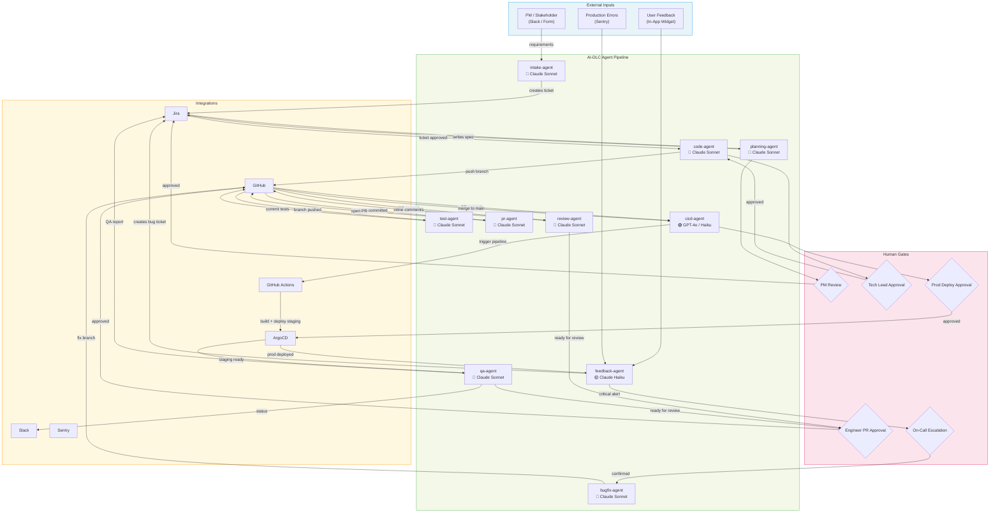

# AI-DLC: AI-Augmented Software Development Lifecycle Framework

> **Version:** 0.1 — Client Presentation Draft  
> **Date:** April 2026  
> **Status:** Pre-approval / Scoping

---

## 1. Executive Summary

AI-DLC is an open-source framework skeleton that wraps a classical Software Development Lifecycle (SDLC) with autonomous AI agents at each stage. Instead of replacing engineers, each agent acts as a specialist accelerator — taking on the repetitive, mechanical, and time-consuming parts of each phase, while humans retain authority over architectural decisions, approvals, and strategic choices.

The result is a pipeline where a requirement entered by a product owner can travel through ticket creation, code generation, automated testing, CI/CD, PR review, and production deployment — with human approval gates placed exactly where judgment is required.

**Key goals:**
- Reduce time-to-PR by 60–80% for well-specified tickets
- Enforce consistent test coverage automatically
- Eliminate manual toil in CI/CD and PR hygiene
- Create a closed feedback loop: production bugs → Jira → fix → deploy

---

## 2. Core Principles

| Principle | Description |
|---|---|
| **Human-in-the-Loop** | Every critical decision point has an optional human approval gate |
| **Tool-native** | Agents use the same tools engineers use (GitHub, Jira, terminal) — not abstractions |
| **Observable** | Every agent action is logged, auditable, and replayable |
| **Modular** | Each agent is a standalone service; swap or disable any without breaking others |
| **Secrets-first** | No credentials in code, prompts, or logs — ever |

---

## 3. Agent Roster

### Agent 1 — Requirements Intake Agent (`intake-agent`)

**Role:** Interfaces with the product owner or stakeholder to gather, clarify, and structure requirements into actionable Jira tickets.

**Trigger:** Slack message, web form submission, email webhook, or manual invocation.

**What it does:**
- Asks clarifying questions in natural language (via Slack bot or web UI)
- Structures answers into Jira ticket format (title, description, acceptance criteria, story points estimate, labels, priority)
- Creates the Jira ticket via Jira REST API
- Tags the ticket as `ai-generated` and assigns it to the appropriate epic/sprint
- Notifies the relevant PM in Slack for review

**Tools used:**
- `jira-api-tool` — create/update Jira issues
- `slack-bot-tool` — interactive conversation in Slack
- `template-renderer` — renders structured ticket templates
- LLM: **Claude 3.5 Sonnet** (strong instruction-following, structured output)

**Human gate:** PM reviews and approves the created ticket before it enters the sprint backlog.

---

### Agent 2 — Planning & Grooming Agent (`planning-agent`)

**Role:** Takes a approved Jira ticket and decomposes it into subtasks, clarifies technical scope, and prepares a dev-ready spec.

**Trigger:** Ticket status changes to `Ready for Dev` in Jira (webhook).

**What it does:**
- Reads the ticket and any linked documents
- Breaks it into subtasks if needed
- Writes a short technical implementation plan in the ticket comments
- Flags risks or missing information back to the PM
- Estimates complexity (S/M/L/XL) and suggests story points

**Tools used:**
- `jira-api-tool` — read/write ticket details and comments
- `confluence-read-tool` — read linked design docs or specs
- LLM: **Claude 3.5 Sonnet**

**Human gate:** Tech lead reviews the implementation plan and approves before coding starts.

---

### Agent 3 — Code Generation Agent (`code-agent`)

**Role:** Takes a dev-ready ticket, creates a feature branch, and implements the solution.

**Trigger:** Ticket status changes to `In Progress` + assigned to `ai-agent` (or manually triggered).

**What it does:**
- Reads ticket + implementation plan
- Clones/fetches the repository via GitHub API
- Creates a branch: `feature/PROJ-123-short-description`
- Writes the implementation following repo conventions (reads existing code for context)
- Commits with conventional commit messages linked to the Jira ticket
- Pushes the branch

**Tools used:**
- `github-api-tool` — create branch, commit, push
- `file-read-tool` / `file-write-tool` — read/write source files
- `code-search-tool` — understand existing codebase patterns
- `bash-exec-tool` — run linters, formatters before commit
- LLM: **Claude 3.5 Sonnet** or **GPT-4o** (both strong at code; Claude preferred for larger context)

**Human gate:** Optional — senior engineer can review the branch before tests run.

---

### Agent 4 — Test Generation Agent (`test-agent`)

**Role:** Generates a comprehensive test suite for the implemented feature — both happy paths and failure/edge cases.

**Trigger:** Code branch pushed (GitHub webhook on push event).

**What it does:**
- Reads the implementation files and the ticket acceptance criteria
- Generates unit tests, integration tests, and E2E test scenarios
- Covers: happy path, boundary values, null/empty inputs, auth failures, rate limits, error states
- Writes tests into the same branch
- Updates test coverage report

**Tools used:**
- `file-read-tool` / `file-write-tool`
- `bash-exec-tool` — run tests locally to validate they pass
- `github-api-tool` — commit test files to branch
- Testing frameworks: **Jest** (JS/TS), **Pytest** (Python), **Playwright** (E2E)
- LLM: **Claude 3.5 Sonnet** (excellent at generating realistic test scenarios)

**Human gate:** None by default, but test files are visible in the PR diff for engineer review.

---

### Agent 5 — CI/CD Agent (`cicd-agent`)

**Role:** Manages pipeline execution, monitors build health, and handles deployment to target environments.

**Trigger:** PR opened or merged (GitHub webhook).

**What it does:**
- Triggers GitHub Actions workflows
- Monitors pipeline status in real time
- On failure: captures logs, identifies failing step, attempts auto-fix (e.g., missing env var, wrong Docker tag)
- On success (staging): triggers deployment to staging via ArgoCD or direct kubectl
- On merge to main: triggers production deployment with canary rollout
- Posts pipeline status back to the PR and Jira ticket

**Tools used:**
- `github-actions-tool` — trigger/monitor workflows
- `argocd-tool` — deploy to Kubernetes clusters
- `docker-tool` — build and push images
- `bash-exec-tool` — run deployment scripts
- LLM: **GPT-4o** or **Claude 3 Haiku** (fast, cost-effective for log parsing)

**Human gate:** Production deployment requires explicit human approval in Slack (`/approve deploy PROJ-123 to prod`).

---

### Agent 6 — QA / Testing Agent (`qa-agent`)

**Role:** Runs and evaluates the full test suite — not just unit tests. Validates the feature against acceptance criteria in a real environment.

**Trigger:** Deployment to staging environment succeeds.

**What it does:**
- Runs E2E tests (Playwright) against staging
- Validates each acceptance criterion from the Jira ticket
- Runs exploratory test scenarios beyond the happy path
- Captures screenshots, network traces, and console errors
- Generates a QA report and posts it to the Jira ticket
- If critical tests fail: blocks PR merge, notifies dev team in Slack

**Tools used:**
- `playwright-tool` — browser automation
- `api-test-tool` (Postman/Newman) — API contract validation
- `jira-api-tool` — post test results
- `slack-bot-tool` — failure notifications
- LLM: **Claude 3.5 Sonnet** (for interpreting test results and writing QA report)

**Human gate:** QA lead reviews the report before approving the PR for merge.

---

### Agent 7 — PR Agent (`pr-agent`)

**Role:** Opens and maintains the Pull Request, keeping it clean and merge-ready.

**Trigger:** QA Agent reports all critical tests passing.

**What it does:**
- Opens a PR from the feature branch to `main` (or `develop`)
- Writes a structured PR description: summary, changes, test coverage, screenshots
- Links the PR to the Jira ticket
- Adds relevant reviewers based on code ownership (CODEOWNERS file)
- Keeps the PR up-to-date with base branch (auto-rebase)
- Responds to review comments by making code changes (delegating to Code Agent)

**Tools used:**
- `github-api-tool` — create PR, manage labels, request reviewers
- `jira-api-tool` — link PR to ticket, update ticket status
- `github-actions-tool` — trigger re-runs of checks
- LLM: **Claude 3.5 Sonnet**

**Human gate:** The PR description and reviewers are visible to all engineers. Merge requires human approval.

---

### Agent 8 — Code Review Agent (`review-agent`)

**Role:** Performs an automated first-pass code review before human reviewers look at the PR.

**Trigger:** PR opened or updated.

**What it does:**
- Reviews diff for: security vulnerabilities, code smells, performance issues, missing error handling, style violations
- Checks that tests actually cover the changed code
- Leaves inline PR comments using GitHub Review API
- Marks review as `approved` (low risk) or `changes-requested` (issues found)
- Does NOT block human reviewers — acts as a pre-filter

**Tools used:**
- `github-api-tool` — read diff, post review comments
- `semgrep-tool` — static analysis for security patterns
- `sonarqube-tool` — code quality metrics (optional)
- LLM: **Claude 3.5 Sonnet** (best-in-class for code review reasoning)

**Human gate:** Human engineer reviews the agent's comments and makes the final approval decision.

---

### Agent 9 — Bug Fix Agent (`bugfix-agent`)

**Role:** Triages and resolves bug reports automatically for well-scoped issues.

**Trigger:** Jira ticket with type `Bug` enters `In Progress` state.

**What it does:**
- Reads the bug report (steps to reproduce, environment, logs, screenshots)
- Searches the codebase for the likely root cause
- Proposes a fix and creates a bugfix branch: `fix/PROJ-456-null-pointer-login`
- Writes a regression test that would have caught the bug
- Goes through the same Code Agent → Test Agent → PR Agent → Review Agent pipeline
- Updates the Jira ticket with root cause analysis in comments

**Tools used:**
- Same toolset as Code Agent + Test Agent
- `log-analysis-tool` — parse stack traces and error logs
- `sentry-tool` — fetch error details and frequency data
- LLM: **Claude 3.5 Sonnet**

**Human gate:** Same as feature: PR must be reviewed and approved by a human engineer.

---

### Agent 10 — Feedback & Triage Agent (`feedback-agent`)

**Role:** Monitors production for errors and user feedback, and feeds issues back into the ticket pipeline.

**Trigger:** Scheduled (every hour) + Sentry webhook on new error spike + user-submitted feedback form.

**What it does:**
- Reads error reports from Sentry (grouped by issue, frequency, affected users)
- Reads user feedback from in-app "Report a Bug" widget
- Deduplicates and clusters similar issues
- Determines severity: Critical / High / Medium / Low
- Creates Jira bug tickets with full context (stack trace, reproduction steps, affected version)
- Notifies on-call engineer in Slack for Critical severity
- For known/recurring issues: links to the existing ticket instead of creating a duplicate

**Tools used:**
- `sentry-tool` — fetch production errors
- `jira-api-tool` — create/search/update tickets
- `slack-bot-tool` — on-call alerts
- `feedback-api-tool` — read in-app feedback submissions
- LLM: **Claude 3 Haiku** (fast, cheap — runs frequently)

**Human gate:** On-call engineer confirms Critical bugs before they get hotfix priority.

---

## 4. System Architecture

```
┌─────────────────────────────────────────────────────────────────┐
│                        EXTERNAL INPUTS                          │
│   PM / Stakeholder   │   Production Errors   │   User Feedback  │
└──────────┬───────────┴──────────┬────────────┴────────┬─────────┘
           │                      │                     │
           ▼                      ▼                     ▼
┌──────────────────┐   ┌─────────────────────────────────────────┐
│  intake-agent    │   │         feedback-agent                  │
│  (Slack/Form UI) │   │   (Sentry + in-app widget + schedule)   │
└────────┬─────────┘   └──────────────────┬──────────────────────┘
         │                                │
         ▼                                ▼
┌─────────────────────────────────────────────────────────────────┐
│                        JIRA                                     │
│              [Tickets created / updated]                        │
└──────────────────────────┬──────────────────────────────────────┘
                           │ Webhook: status change
                           ▼
              ┌────────────────────────┐
              │    planning-agent      │
              │ (decompose + spec)     │
              └────────────┬───────────┘
                           │ Human gate: Tech Lead approves spec
                           ▼
              ┌────────────────────────┐
              │     code-agent         │
              │ (branch + implement)   │
              └────────────┬───────────┘
                           │ Push to branch
                           ▼
              ┌────────────────────────┐
              │     test-agent         │
              │ (unit + E2E tests)     │
              └────────────┬───────────┘
                           │ Commit tests to branch
                           ▼
              ┌────────────────────────┐
              │      pr-agent          │
              │ (open PR, description) │
              └────────────┬───────────┘
                           │ PR opened
              ┌────────────┴───────────┐
              │                        │
              ▼                        ▼
┌─────────────────────┐   ┌──────────────────────┐
│   review-agent      │   │     cicd-agent        │
│ (inline PR review)  │   │ (build + staging dep) │
└────────────┬────────┘   └──────────┬────────────┘
             │                       │ Staging deployed
             │             ┌─────────┴────────────┐
             │             │      qa-agent         │
             │             │ (E2E on staging)      │
             │             └─────────┬─────────────┘
             │                       │ QA report posted
             └───────────┬───────────┘
                         │ Human gate: Engineer approves PR
                         ▼
              ┌────────────────────────┐
              │    MERGE to main       │
              └────────────┬───────────┘
                           │ Human gate: Approve prod deploy
                           ▼
              ┌────────────────────────┐
              │     cicd-agent         │
              │ (prod deploy + canary) │
              └────────────┬───────────┘
                           │
                           ▼
              ┌────────────────────────┐
              │   feedback-agent       │
              │ (monitoring loop)      │
              └────────────────────────┘
```

---

## 5. Tool Stack

### Orchestration & Agent Framework

| Tool | Role | Why |
|---|---|---|
| **LangGraph** | Primary agent orchestration | Stateful, graph-based workflows; supports cycles (retry loops); best for complex multi-step agents |
| **LangChain** | Tool abstractions + LLM wrappers | Large ecosystem, pre-built integrations |
| **Prefect** | Pipeline scheduling & monitoring | Human-readable flow definitions, built-in retry, dashboard |

> **Alternative:** CrewAI is simpler to set up but less flexible for complex state management. AutoGen (Microsoft) is good for multi-agent conversations but harder to productionize.

### LLM Models

| Model | Use Case | Why |
|---|---|---|
| **Claude 3.5 Sonnet** | Code generation, review, test writing, PR descriptions | Best overall code quality and instruction following; 200k context for large diffs |
| **GPT-4o** | Alternative for code, CI log analysis | Strong general reasoning, good fallback |
| **Claude 3 Haiku** | Feedback agent, fast classification tasks | 5x cheaper, fast — for high-frequency, low-complexity tasks |
| **Gemini 1.5 Pro** | Optional: large codebase indexing | 1M context window — useful for reading entire repos |

### Jira Integration

| Component | Tool |
|---|---|
| Ticket CRUD | Jira REST API v3 (`/rest/api/3/issue`) |
| Webhooks (status changes) | Jira Automation Webhooks → agent endpoint |
| Auth | Jira API Token (user-scoped) stored in Vault |
| Search | JQL queries via API |

### GitHub Integration

| Component | Tool |
|---|---|
| Branch management | GitHub REST API + `PyGithub` library |
| PR creation & review | GitHub REST API (`/repos/{owner}/{repo}/pulls`) |
| Webhooks (push, PR events) | GitHub Webhooks → ngrok (dev) / API Gateway (prod) |
| Auth | **GitHub App** (preferred over PAT) — scoped permissions, auto-rotating tokens |
| CI/CD | GitHub Actions (YAML workflows in `.github/workflows/`) |
| Static analysis | `semgrep` via GitHub Actions |

> **Why GitHub App over Personal Access Token:** GitHub Apps have fine-grained permissions per repo, support installation tokens (short-lived, auto-rotating), and don't tie auth to an individual user account — much safer for production.

### CI/CD

| Tool | Role |
|---|---|
| **GitHub Actions** | Primary CI — run tests, lint, build Docker image |
| **Docker** | Containerize all services including agents |
| **ArgoCD** | GitOps-based deployment to Kubernetes |
| **Helm** | Package Kubernetes manifests |

### Testing

| Tool | Scope |
|---|---|
| **Jest** | Unit + integration tests (JavaScript/TypeScript) |
| **Pytest** | Unit + integration tests (Python) |
| **Playwright** | E2E browser automation |
| **Postman/Newman** | API contract testing |
| **k6** | Load/performance testing (optional phase 2) |

### Monitoring & Error Tracking

| Tool | Role |
|---|---|
| **Sentry** | Production error tracking, stack traces |
| **Datadog** | Infrastructure + APM monitoring |
| **Grafana + Prometheus** | Self-hosted alternative to Datadog |

### Notifications & Human Gates

| Tool | Role |
|---|---|
| **Slack** | All agent notifications + approval flows |
| **Slack Workflow Builder** | Human approval buttons (`/approve`, `/reject`) |
| **PagerDuty** | On-call escalation for Critical bugs |

---

## 6. Secrets & Credentials Management

**Rule #1: No secrets in code, prompts, environment files committed to git, or agent logs.**

### Architecture

```
┌─────────────────────────────────────────────┐
│           HashiCorp Vault                   │
│  (or AWS Secrets Manager / GCP Secret Mgr)  │
│                                             │
│  Secrets stored:                            │
│  - JIRA_API_TOKEN                           │
│  - GITHUB_APP_PRIVATE_KEY                   │
│  - GITHUB_APP_ID                            │
│  - ANTHROPIC_API_KEY                        │
│  - OPENAI_API_KEY                           │
│  - SENTRY_AUTH_TOKEN                        │
│  - SLACK_BOT_TOKEN                          │
│  - DATABASE_URL (per environment)           │
└──────────────────┬──────────────────────────┘
                   │ Vault Agent sidecar injects
                   │ secrets at runtime
                   ▼
        ┌─────────────────────┐
        │   Agent Containers  │
        │ (read secrets from  │
        │  env vars at start) │
        └─────────────────────┘
```

### Strategy

| Concern | Solution |
|---|---|
| LLM API keys | Stored in Vault; injected as env vars; never passed in prompts |
| GitHub auth | GitHub App installation token (1h expiry, auto-rotated) |
| Jira auth | Jira API Token stored in Vault; rotated quarterly |
| Agent-to-agent auth | Internal JWT tokens signed by Vault |
| Audit | Vault audit log for all secret reads |
| Local dev | `.env.local` (gitignored) + `direnv` for auto-loading |

### `.gitignore` essentials
```
.env
.env.local
.env.*
*.pem
secrets/
vault-token
```

---

## 7. Human-in-the-Loop Gates

The following table defines where humans must intervene. All gates are implemented as Slack approval messages with `Approve` / `Reject` buttons.

| Gate | Agent | Who approves | Timeout behavior |
|---|---|---|---|
| Ticket review | `intake-agent` | PM / Product Owner | 48h → ticket moved to backlog |
| Implementation plan | `planning-agent` | Tech Lead | 24h → auto-escalate |
| Feature branch review | `code-agent` | Senior Engineer (optional) | Skippable |
| QA report review | `qa-agent` | QA Lead | 24h → auto-escalate |
| PR approval | `pr-agent` | Assigned reviewers (min 1) | 24h → reminder sent |
| Production deployment | `cicd-agent` | Engineering Manager | No timeout — must be explicit |
| Critical bug priority | `feedback-agent` | On-call Engineer | 1h → PagerDuty escalation |

---

## 8. Repository Structure (Framework Skeleton)

```
ai-dlc/
├── agents/
│   ├── intake-agent/
│   │   ├── agent.py
│   │   ├── tools/
│   │   │   ├── jira_tool.py
│   │   │   └── slack_tool.py
│   │   └── prompts/
│   │       └── intake_system_prompt.txt
│   ├── code-agent/
│   ├── test-agent/
│   ├── pr-agent/
│   ├── review-agent/
│   ├── cicd-agent/
│   ├── qa-agent/
│   ├── bugfix-agent/
│   ├── planning-agent/
│   └── feedback-agent/
├── shared/
│   ├── tools/
│   │   ├── github_tool.py       # GitHub App auth + API wrappers
│   │   ├── jira_tool.py         # Jira REST API wrappers
│   │   ├── slack_tool.py        # Slack bot + approval flows
│   │   ├── vault_tool.py        # HashiCorp Vault client
│   │   ├── sentry_tool.py       # Sentry API wrapper
│   │   └── bash_exec_tool.py    # Safe shell execution with sandbox
│   ├── models/
│   │   └── llm_factory.py       # LLM provider abstraction (Claude/GPT/Haiku)
│   ├── state/
│   │   └── ticket_state.py      # Shared state schema (Jira ticket → pipeline state)
│   └── auth/
│       └── github_app_auth.py   # GitHub App token rotation
├── orchestration/
│   ├── graph.py                 # LangGraph workflow definition
│   ├── webhooks/
│   │   ├── github_webhook.py    # GitHub event receiver
│   │   └── jira_webhook.py      # Jira status change receiver
│   └── scheduler.py             # Prefect flows for scheduled agents
├── infrastructure/
│   ├── docker/
│   │   └── Dockerfile.agent     # Base agent image
│   ├── k8s/
│   │   └── helm/                # Helm chart for agent deployments
│   └── github-actions/
│       └── workflows/           # CI/CD pipeline definitions
├── config/
│   ├── agents.yaml              # Agent enable/disable + config
│   └── gates.yaml               # Human gate timeout configuration
├── tests/
│   └── agent-tests/             # Tests for the agents themselves
├── docs/
│   └── architecture.md
├── .env.example                 # Template (no real values)
├── .gitignore
└── README.md
```

---

## 9. Where Does Everything Run?

| Component | Runtime | Notes |
|---|---|---|
| Agents | **Docker containers on Kubernetes** | Each agent is a stateless service; scales independently |
| LangGraph orchestration | Same containers | Embedded in each agent |
| Prefect scheduler | **Prefect Cloud** (managed) or self-hosted | Schedules `feedback-agent`, health checks |
| Webhook receivers | **AWS API Gateway + Lambda** (or K8s Ingress) | Lightweight, serverless — receives GitHub/Jira webhooks |
| Vault | **HashiCorp Vault** self-hosted on K8s | Or AWS Secrets Manager if on AWS |
| Vector store (codebase context) | **Pinecone** or **pgvector** | For semantic code search by agents |
| Local dev | **Docker Compose** | Simulates the full stack locally |

---

## 10. Integration Setup Checklist

### Jira
- [ ] Create a dedicated service account: `ai-dlc-bot@company.com`
- [ ] Generate API Token under that account
- [ ] Store token in Vault at `secret/jira/api-token`
- [ ] Create Jira Automation rule: on ticket status change → POST to agent webhook
- [ ] Create custom label `ai-generated` in Jira
- [ ] Create workflow status: `AI In Progress`

### GitHub
- [ ] Register a GitHub App in organization settings
- [ ] Grant permissions: `Contents: Write`, `Pull requests: Write`, `Checks: Write`, `Issues: Read`
- [ ] Generate and store private key in Vault at `secret/github/app-private-key`
- [ ] Install the GitHub App on target repositories
- [ ] Configure webhook: push, pull_request, check_run → agent webhook URL
- [ ] Add CODEOWNERS file to repos

### Slack
- [ ] Create Slack App with bot token
- [ ] Add bot to relevant channels (`#dev-agents`, `#deployments`, `#on-call`)
- [ ] Set up interactive message actions for approval buttons
- [ ] Store `SLACK_BOT_TOKEN` in Vault

### Sentry
- [ ] Create internal integration with `event:read` scope
- [ ] Set up Sentry webhook: new issue spike → `feedback-agent`
- [ ] Store auth token in Vault

---

## 11. Open Source Positioning

This framework will be designed and released as **open source** (MIT License) with the following structure:

- **Core framework:** Generic, repo-agnostic agents + tool abstractions
- **Adapters:** Pluggable adapters for Jira, Linear, GitHub, GitLab, Slack, Teams
- **Config-driven:** `agents.yaml` controls which agents are enabled, their LLM, and their gate behavior
- **Self-hostable:** Full Docker Compose for local, Helm chart for production

**Comparable open source projects to be aware of:**
- [SWE-agent](https://github.com/princeton-nlp/SWE-agent) — agent for solving GitHub issues (inspiration for code-agent)
- [Sweep AI](https://github.com/sweepai/sweep) — AI junior engineer (similar scope, less modular)
- [OpenDevin](https://github.com/OpenDevin/OpenDevin) — open source coding agent platform
- [Agentless](https://github.com/OpenAutoCoder/Agentless) — minimal code repair pipeline

AI-DLC differentiates by covering the **full SDLC** (not just coding), having **explicit human gates**, and being **Jira-native** from day one.

---

## 12. Phased Delivery Plan (High Level)

| Phase | Scope | Estimated Duration |
|---|---|---|
| **Phase 0** | Architecture finalization, tooling setup, repo scaffold, Jira/GitHub integration, Vault | 2 weeks |
| **Phase 1** | `intake-agent` + `planning-agent` + Jira integration working end-to-end | 3 weeks |
| **Phase 2** | `code-agent` + `test-agent` + `pr-agent` + GitHub integration | 4–5 weeks |
| **Phase 3** | `review-agent` + `cicd-agent` + `qa-agent` + staging pipeline | 3–4 weeks |
| **Phase 4** | `bugfix-agent` + `feedback-agent` + Sentry integration | 2–3 weeks |
| **Phase 5** | Human gate Slack flows, observability, hardening, open source release | 2–3 weeks |
| **Total** | | **~16–20 weeks** |

---

## 13. Architecture Diagram (Mermaid)



---

## 14. Risk Register

| Risk | Likelihood | Impact | Mitigation |
|---|---|---|---|
| LLM generates incorrect code | High | High | Mandatory test suite + human PR review |
| Agent runs up large LLM bill | Medium | Medium | Token budget per ticket; use Haiku for cheap tasks |
| Jira/GitHub API rate limits | Low | Medium | Exponential backoff + request queuing |
| Secret exposure in logs | Low | Critical | Structured logging with secret scrubbing |
| Agent enters infinite loop | Medium | Medium | Max iterations per workflow; circuit breaker |
| PR review agent misses security issue | Medium | High | Semgrep for deterministic security checks; human is final approver |

---

*Document generated as part of AI-DLC pre-sale technical proposal.*
