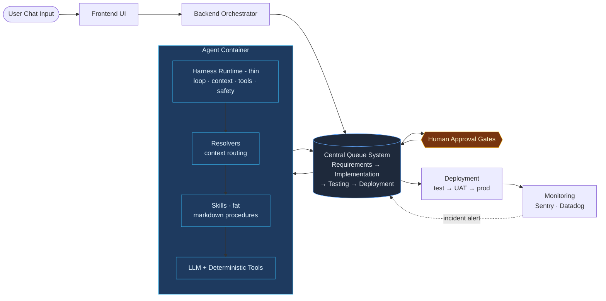
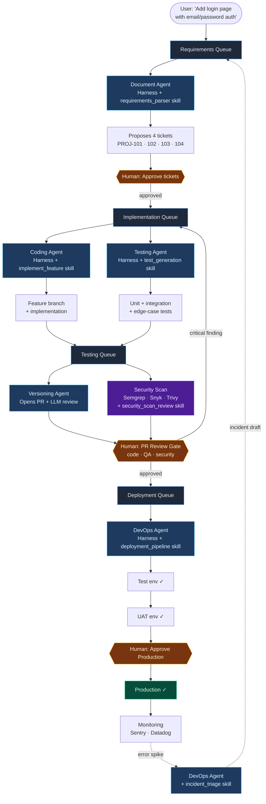

# Example End-to-End Agentic SDLC Flow

## Queue-Orchestrated Delivery with Harness Runtime Layer

This document describes a simple example workflow showing how a feature request moves through the agentic delivery system.

Example request:

> Add a login page with email/password authentication

The system processes this request through structured queues, agent containers, harness runtime layers, and human approval gates before deploying to production.

---

# System Overview

High-level execution flow:

```
User Chat Input
↓
Frontend UI
↓
Backend Orchestrator
↓
Central Queue System
↓
Agent Containers
    └── Harness Runtime Layer (thin)
            └── Skills (fat) + Resolvers + LLM + Tools
↓
Human Approval Gates
↓
Deployment Environments
↓
Monitoring Loop → back to Requirements Queue
```

Queues control lifecycle progression.
Harness controls execution context (thin: loop, context, tools, safety).
Skills carry the process and judgment (fat: markdown procedures).
LLM provides reasoning; deterministic tools provide reliability.

---

## High-Level Architecture



**The principle:** queues control lifecycle, harness stays thin, skills carry the judgment, monitoring closes the loop.

---

# Step 1 - User Request

User submits a feature request:

```
Add login page with email/password authentication
```

Flow:

```
User Chat Input
↓
Frontend UI
↓
Backend Orchestrator
↓
Requirements Queue
```

The orchestrator creates a workflow item inside the Requirements Queue.

---

# Step 2 - Requirements Queue

## Document Agent Container Executes

Purpose:

Convert natural language request into structured engineering tickets.

### Agent Logic Responsibilities

The Document Agent:

* interprets feature request intent
* decomposes request into tasks
* generates structured Jira tickets
* attaches acceptance criteria
* proposes labels and story points
* prepares implementation outline

Example generated tickets:

```
PROJ-101 Create login page UI
PROJ-102 Implement authentication backend
PROJ-103 Add validation and error handling
PROJ-104 Add unit and integration tests
```

---

### Harness Runtime Responsibilities

The Harness Runtime prepares execution context before the model runs.

It loads:

* project documentation
* ticket templates
* engineering standards
* backlog conventions
* architecture constraints
* existing authentication modules (if present)

It activates:

```
ticket_generator_skill
requirements_parser_skill
acceptance_criteria_formatter
```

It connects tools:

```
Jira API
documentation storage
vector context index
```

The harness ensures the model operates with structured project awareness.

---

### LLM Model Responsibilities

The model generates:

* ticket titles
* ticket descriptions
* acceptance criteria
* subtasks
* edge-case suggestions
* dependency hints

Output:

```
Structured Jira tickets created
Status: pending human approval
```

---

# Step 3 - Human Approval Gate

Engineer or product owner reviews generated tickets.

Available actions:

```
Approve
Edit + Approve
Reject with Feedback
```

If approved:

```
Requirements Queue
↓
Implementation Queue
```

---

# Step 4 - Implementation Queue

## Coding Agent Container Executes

Purpose:

Implement the approved feature inside the repository.

---

### Agent Logic Responsibilities

The Coding Agent:

* creates feature branch
* reads Jira ticket context
* implements feature code
* follows repository conventions
* prepares commit structure
* coordinates with testing agent

Example:

```
branch: feature/login-page-authentication
```

---

### Harness Runtime Responsibilities

The Harness Runtime loads:

```
repository embeddings
architecture documentation
authentication module patterns
code style guidelines
existing login components
```

It activates:

```
implement_feature_skill
repo_navigation_skill
dependency_analysis_skill
```

It connects tools:

```
Git provider
test runner
dependency inspector
code search index
```

The harness ensures the model writes correct code aligned with project standards.

---

### LLM Model Responsibilities

The model generates:

```
frontend login page
backend authentication handler
validation logic
error states
session handling
integration points
```

Output:

```
Feature branch created
Implementation completed
Tests prepared
```

Workflow continues:

```
Implementation Queue
↓
Testing Queue
```

---

# Step 5 - Testing Queue

## Testing Agent Container Executes

Purpose:

Validate correctness, coverage, and reliability of the implementation.

---

### Agent Logic Responsibilities

The Testing Agent:

* generates unit tests
* generates integration tests
* generates edge-case tests
* executes full test suite
* analyzes failures
* reports coverage

---

### Harness Runtime Responsibilities

The Harness Runtime loads:

```
test templates
coverage requirements
QA standards
previous regression issues
edge-case detection patterns
```

It activates:

```
test_generation_skill
coverage_validation_skill
failure_analysis_skill
```

It connects tools:

```
test runner
coverage reporter
preview environment
CI pipeline interface
```

---

### LLM Model Responsibilities

The model generates:

```
unit test scenarios
integration test scenarios
failure-path validation
boundary-condition handling
missing-case detection
```

Output:

```
QA report generated
Coverage verified
Test status confirmed
```

Workflow continues:

```
Testing Queue
↓
Human Approval Gate
```

---

# Step 6 - Automated Security Scan

Security scanning runs automatically in parallel with the QA report - no human required to trigger it.

## What runs (deterministic tools)

```
SAST:        Semgrep / SonarQube  → scans code diff for vulnerability patterns
Dependency:  Snyk                 → checks updated packages against CVE database
Container:   Trivy                → scans new image builds for known vulnerabilities
```

These are deterministic steps. Same input, same output, every time. The LLM does not run the scanner - it interprets the results.

## Security Agent (Harness Runtime)

The Harness Runtime activates:

```
security_scan_review skill
```

It loads:

```
scan output (SAST findings, CVE list, image scan report)
project security policy
severity classification rules
remediation patterns
```

The LLM interprets each finding and produces:

```
risk classification (critical / high / medium / low)
block or proceed recommendation
remediation hint per finding
plain-language summary for the PR reviewer
```

## Output

```
0 critical findings   → proceed automatically to PR Review Gate
≥1 critical finding   → block; human must explicitly acknowledge before proceeding
```

---

# Step 7 - Pull Request Review Gate

Engineer reviews all of the following in a single panel:

```
Pull request summary
Automated first-pass code review (LLM inline comments)
QA report (test results + coverage)
Security scan summary (severity breakdown + recommendations)
```

Available actions:

```
Approve
Request Changes
Block
```

If approved:

```
Testing Queue
↓
Deployment Queue
```

---

# Step 8 - Deployment Queue

## DevOps Agent Container Executes

Purpose:

Promote implementation across environments safely.

---

### Agent Logic Responsibilities

The DevOps Agent:

* merges branch
* deploys to test environment
* promotes to UAT
* prepares production deployment
* updates Jira ticket status
* reports deployment results

---

### Harness Runtime Responsibilities

The Harness Runtime loads:

```
deployment pipeline configuration
environment promotion rules
security policies
rollback procedures
release notes templates
```

It activates:

```
deployment_pipeline_skill
environment_promotion_skill
rollback_strategy_skill
```

It connects tools:

```
GitHub Actions / GitLab CI
ArgoCD
Kubernetes
monitoring tools
Slack notifications
```

---

### LLM Model Responsibilities

The model generates:

```
deployment summaries
release notes
environment validation reports
failure diagnostics (if needed)
```

---

# Step 9 - Production Deployment Gate

Production release always requires explicit approval.

```
Approve Production Deploy
```

After approval:

```
Deployment Queue
↓
Production Environment
```

Feature becomes live.

---

# Step 10 - Monitoring Loop (Post-Deploy)

After the feature is live, the pipeline does not end.

## What happens

```
Sentry / monitoring tool emits alert
↓
Webhook received by Backend Orchestrator
↓
DevOps Agent activates
```

The DevOps Agent's Harness Runtime activates:

```
incident_triage skill
```

It loads:

```
Sentry event details
affected version
recent deploy diff (what changed in this release)
prior incident history for this service
```

The LLM generates:

```
root cause hypothesis
suggested ticket title and description
affected component + owner
severity estimate
```

Output:

```
Incident draft → Requirements Queue (pending human review)
```

Engineer reviews the draft:

```
Confirm as incident → high-priority ticket enters Implementation Queue
Dismiss            → logged, no action taken
```

The pipeline feeds back on itself. A degraded production system generates its own ticket.

---

# Final Result

End-to-end lifecycle:

```
User Request
↓
Requirements Queue
↓
Implementation Queue
↓
Testing Queue
↓
Security Scan (automated, deterministic tools + LLM interpretation)
↓
PR Review Gate (human)
↓
Deployment Queue
↓
Production
↓
Monitoring Loop → [incident → Requirements Queue]
```

---

## End-to-End Flow - Login Feature Example

Following the example request *"Add login page with email/password authentication"* through every stage:



**What to notice in the diagram:**

- Every agent runs inside its own harness with a specific skill invoked (e.g., `implement_feature`, `test_generation`, `security_scan_review`) - thin harness, fat skills
- Security scan is a dedicated stage with deterministic tools (Semgrep, Snyk, Trivy), not a side-note on a review comment
- Human gates appear only at the three points where judgment matters: ticket approval, PR review, production deploy
- The monitoring loop closes back to the Requirements Queue - the SDLC is a cycle, not a one-way pipeline

---

Each stage:

```
Executed by agent containers
Powered by harness runtime (thin)
Guided by LLM reasoning through skill files (fat)
Controlled by human approval gates at the right moments
```

The harness stays thin - loop, context, tools, safety.
The skills stay fat - process, judgment, domain knowledge.
The queue controls lifecycle progression.
The monitoring loop closes the SDLC cycle.

This architecture enables structured, safe, explainable AI-assisted software delivery across the full SDLC pipeline - from user story to production, and back again.
